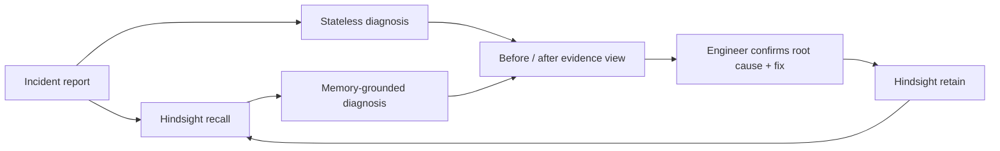

# 🐛 BugFix

### Your last outage should make the next one shorter.

[](https://hindsight.vectorize.io/)
[](https://react.dev/)
[](https://nodejs.org/)
[](#quality-checks)

BugFix is a memory-powered incident-response copilot. It recalls how your team resolved similar production failures, compares that advice with a stateless AI baseline, and learns only the outcome an engineer confirms.

> **The key idea:** do not make the model's guess your organization's memory. Make the verified resolution the memory.

---

## ⚡ The 60-second story

Imagine the checkout API starts returning `401` immediately after a deployment.

- A generic assistant lists every common JWT failure.
- BugFix recalls that this team's production pods previously referenced an old secret version.
- The UI shows both answers side by side and exposes the exact recalled evidence.
- An engineer verifies the cause, records the real fix, and teaches the next investigation.

The result is not another chatbot. It is a debugging system whose operational knowledge compounds.

## Why it matters

Teams repeatedly pay to rediscover the same deployment traps, configuration drift, and service-specific failure modes. Generic assistants can suggest common causes, but they do not know that *this* team's checkout service once returned 401s because production pods referenced the previous JWT secret.

BugFix turns resolved incidents into project-scoped, searchable operational knowledge:

1. Describe the incident with symptoms and logs.
2. Recall related facts from that project's Hindsight bank.
3. Generate a stateless baseline and a memory-grounded diagnosis side by side.
4. Show the exact memory evidence and what it changed.
5. Let an engineer confirm the actual root cause and fix.
6. Retain that verified resolution for the next incident.

## What makes this different

- **Memory is visible:** a before/after view makes its value obvious in seconds.
- **Learning is evidence-gated:** speculative diagnoses are not retained automatically.
- **Banks are project-scoped:** unrelated teams and systems do not pollute one another's context.
- **Recall is explainable:** the interface shows the facts Hindsight returned and the memory contribution to the answer.
- **Logs are treated as data:** prompts explicitly reject instructions embedded in logs or recalled text.
- **The workflow is operational:** service, environment, severity, logs, confidence, checks, mitigation, and confirmed resolution are first-class fields.

## Before vs. after

| Before | After |
|---|---|
| One free-text bug box | Structured incident workspace with service, environment, severity, symptoms, and logs |
| One opaque AI answer | Stateless and memory-grounded diagnoses shown side by side |
| Every investigation starts from zero | Project-scoped Hindsight recall brings forward relevant team experience |
| AI output is automatically remembered | Only a developer-confirmed root cause and verified fix are retained |
| Recalled memory is hidden in a prompt | Memory evidence, source context, contribution, and recall count are visible |
| One global memory bank | Isolated `bugfix-<project-id>` banks reduce cross-project contamination |
| Unstructured response text | Stable JSON diagnosis contract with confidence, checks, likely cause, and mitigation |
| Limited validation and failure states | Input limits, graceful recall fallback, health status, and safe public errors |
| Desktop-only demo feel | Polished responsive interface with built-in realistic scenarios |

## Feature map

| Feature | Why it matters |
|---|---|
| **Before / after mode** | Makes the value of memory obvious to a judge in seconds |
| **Verified learning loop** | Prevents a model's unverified guess from becoming durable organizational knowledge |
| **Project memory banks** | Keeps each team's incidents relevant and independently searchable |
| **Memory evidence ledger** | Lets users inspect what Hindsight recalled instead of trusting an unexplained answer |
| **Structured incident contract** | Produces consistent diagnoses the UI and future integrations can consume |
| **Prompt-injection boundary** | Treats logs and recalled memories as untrusted evidence, never instructions |
| **Graceful degradation** | Still returns an investigation when memory recall is unavailable |
| **Demo scenarios** | JWT rollout and database-pool incidents make the value proposition immediately testable |
| **Resolution retention** | Stores root cause, verified fix, outcome, service context, tags, timestamp, and document ID |
| **Responsive UX** | Works cleanly on desktop and mobile-sized screens |

## Architecture



Hindsight is the durable memory layer. `retain` converts confirmed incident narratives into structured facts and linked entities; `recall` combines semantic, keyword, graph, and temporal retrieval. BugFix allocates a bounded memory budget and passes the returned facts to the diagnosis model as evidence.

See [the detailed memory contract](docs/ARCHITECTURE.md) and the [90-second demo runbook](docs/DEMO.md).

## Tech stack

- React 19 + Vite
- Node.js + Express
- [Hindsight](https://github.com/vectorize-io/hindsight) via `@vectorize-io/hindsight-client`
- Groq chat completions (model configurable with `GROQ_MODEL`)

## Run locally

Requirements: Node.js 20+ and credentials for Groq and either [Hindsight Cloud](https://ui.hindsight.vectorize.io) or a self-hosted Hindsight instance.

```bash
git clone --branch codex/incident-learning-loop \
  https://github.com/MariyaAnjum937/bugfix-memory-agent.git
cd bugfix-memory-agent

cd backend
cp .env.example .env
# Add GROQ_API_KEY, HINDSIGHT_BASE_URL, and HINDSIGHT_API_KEY
npm ci
npm run dev
```

In a second terminal:

```bash
cd frontend
cp .env.example .env
npm ci
npm run dev
```

Open `http://localhost:5173`. Use the built-in **JWT rollout** scenario for the fastest demo.

### Local test links

- App: [http://localhost:5173](http://localhost:5173)
- Backend health: [http://localhost:3000/api/health](http://localhost:3000/api/health)
- Backend root: [http://localhost:3000](http://localhost:3000)

## Test every feature

### 1. Verify configuration

Open the backend health URL. Both `memory` and `model` should report `configured`. The header in the app should show **Hindsight connected**.

### 2. See the no-memory baseline

1. Open the app and click **JWT rollout**.
2. Keep **Before / after mode** enabled.
3. Use a new memory-bank name such as `demo-first-run`.
4. Click **Investigate incident**.

Expected: the left card contains the stateless diagnosis; the right card reports no useful prior incident; the evidence ledger explains that the bank has no matching memory.

### 3. Teach BugFix a verified resolution

1. Click **Confirm resolution**.
2. Use this root cause: `Production pods referenced payments-jwt-v3 after the issuer rotated to payments-jwt-v4.`
3. Use this fix: `Updated the Kubernetes secret reference and rolled the checkout deployment.`
4. Retain the verified resolution.

Expected: BugFix confirms that the incident was retained in the project-scoped Hindsight bank.

### 4. Prove that memory changes the answer

1. Run the **JWT rollout** scenario again using the same memory-bank name.
2. Compare the two diagnosis cards.
3. Inspect **Memory evidence** and **Memory contribution**.

Expected: Hindsight recalls the confirmed secret-rotation incident, and the grounded diagnosis prioritizes verifying secret versions rather than returning only generic JWT advice.

### 5. Verify project isolation

Change the memory bank to `another-team` and repeat the incident.

Expected: the previously confirmed resolution is not recalled because each project gets its own Hindsight bank.

### 6. Test memory-only mode

Disable **Before / after mode** and investigate again.

Expected: only the Hindsight-grounded diagnosis is generated, reducing latency and model usage after the demo comparison is no longer needed.

### 7. Test validation and resilience

- Submit a description shorter than 12 characters: the API should return a helpful validation message.
- Stop or misconfigure Hindsight: the trace should show memory as unavailable while the model still produces a diagnosis.
- Resize the browser below 850px: the incident workspace and diagnosis cards should collapse into a mobile layout.

For a rehearsed presentation, follow the [90-second demo runbook](docs/DEMO.md).

## Environment variables

| Variable | Purpose |
|---|---|
| `GROQ_API_KEY` | Groq authentication |
| `GROQ_MODEL` | Chat model; defaults to `openai/gpt-oss-20b` |
| `HINDSIGHT_BASE_URL` | Cloud or self-hosted Hindsight endpoint |
| `HINDSIGHT_API_KEY` | Hindsight Cloud authentication |
| `HINDSIGHT_BANK_PREFIX` | Prefix for project-scoped banks |
| `FRONTEND_ORIGIN` | Allowed browser origin |
| `VITE_API_URL` | Browser-visible backend URL |

Never commit `.env` files or paste secrets into incident logs.

## API example

```bash
curl -X POST http://localhost:3000/api/incidents/analyze \
  -H 'Content-Type: application/json' \
  -d '{
    "projectId": "payments-platform",
    "title": "Checkout API returns 401 after deploy",
    "service": "checkout-api",
    "environment": "production",
    "severity": "SEV-2",
    "symptoms": "Authenticated checkout requests fail after the latest rollout.",
    "logs": "JWT verification failed: invalid signature",
    "memoryMode": "compare"
  }'
```

The response includes a baseline diagnosis, memory-guided diagnosis, recalled facts, a project bank identifier, and an incident ID used to confirm the resolution.

## Quality checks

```bash
cd backend
npm test

cd ../frontend
npm run lint
npm run build
```

Current verification: **4 backend tests passing, frontend lint clean, and production build successful.**

## Current boundaries

- Pending investigations are kept in process memory and expire on restart. A production deployment should persist them in a database.
- Authentication and role-based access are not yet implemented; project bank IDs alone are not an authorization boundary.
- Recommendations assist an engineer; they must not execute production changes automatically.
- Recall quality improves as teams confirm more incidents and use consistent project/service names.

## Roadmap

- GitHub and Slack incident ingestion
- Team authentication and audited bank access
- Resolution quality review before retain
- MTTR and repeated-incident analytics
- Hindsight observation views for recurring failure patterns

## High-impact next features

1. **Incident timeline and MTTR analytics** — quantify whether memory is actually shortening investigations.
2. **GitHub issue ingestion** — turn resolved issues and postmortems into reviewed incident memories.
3. **Slack/PagerDuty ingestion** — capture the real incident trail without asking engineers to rewrite it.
4. **Memory quality controls** — approve, correct, supersede, or forget retained resolutions.
5. **Team authentication and RBAC** — make project-bank access a real security boundary.
6. **Recurring-pattern observations** — use Hindsight observations to surface systemic causes across incidents.
7. **Resolution confidence and evidence links** — attach deploys, commits, dashboards, and log excerpts to confirmed fixes.
8. **Public demo deployment** — host the frontend and API with secrets stored server-side for one-click judging.

## Hindsight resources

- [Hindsight documentation](https://hindsight.vectorize.io/)
- [Hindsight GitHub repository](https://github.com/vectorize-io/hindsight)
- [How agent memory works](https://vectorize.io/what-is-agent-memory)
