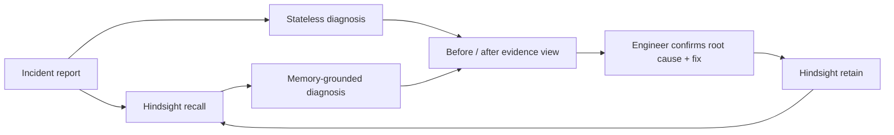

# BugFix — incident intelligence that compounds

BugFix is a memory-powered incident-response copilot. It recalls how your team resolved similar production failures, compares that advice with a stateless AI baseline, and learns only the outcome an engineer confirms.

The key idea is simple: **do not make the model's guess your organization's memory. Make the verified resolution the memory.**

## Why it matters

Teams repeatedly pay to rediscover the same deployment traps, configuration drift, and service-specific failure modes. Generic assistants can suggest common causes, but they do not know that *this* team's checkout service once returned 401s because production pods referenced the previous JWT secret.

BugFix turns resolved incidents into project-scoped, searchable operational knowledge:

1. Describe the incident with symptoms and logs.
2. Recall related facts from that project's Hindsight bank.
3. Generate a stateless baseline and a memory-grounded diagnosis side by side.
4. Show the exact memory evidence and what it changed.
5. Let an engineer confirm the actual root cause and fix.
6. Retain that verified resolution for the next incident.

## What makes this different

- **Memory is visible:** a before/after view makes its value obvious in seconds.
- **Learning is evidence-gated:** speculative diagnoses are not retained automatically.
- **Banks are project-scoped:** unrelated teams and systems do not pollute one another's context.
- **Recall is explainable:** the interface shows the facts Hindsight returned and the memory contribution to the answer.
- **Logs are treated as data:** prompts explicitly reject instructions embedded in logs or recalled text.
- **The workflow is operational:** service, environment, severity, logs, confidence, checks, mitigation, and confirmed resolution are first-class fields.

## Architecture



Hindsight is the durable memory layer. `retain` converts confirmed incident narratives into structured facts and linked entities; `recall` combines semantic, keyword, graph, and temporal retrieval. BugFix allocates a bounded memory budget and passes the returned facts to the diagnosis model as evidence.

See [the detailed memory contract](docs/ARCHITECTURE.md) and the [90-second demo runbook](docs/DEMO.md).

## Tech stack

- React 19 + Vite
- Node.js + Express
- [Hindsight](https://github.com/vectorize-io/hindsight) via `@vectorize-io/hindsight-client`
- Groq chat completions (model configurable with `GROQ_MODEL`)

## Run locally

Requirements: Node.js 20+ and credentials for Groq and either [Hindsight Cloud](https://ui.hindsight.vectorize.io) or a self-hosted Hindsight instance.

```bash
git clone https://github.com/MariyaAnjum937/bugfix-memory-agent.git
cd bugfix-memory-agent

cd backend
cp .env.example .env
# Add GROQ_API_KEY, HINDSIGHT_BASE_URL, and HINDSIGHT_API_KEY
npm ci
npm run dev
```

In a second terminal:

```bash
cd frontend
cp .env.example .env
npm ci
npm run dev
```

Open `http://localhost:5173`. Use the built-in **JWT rollout** scenario for the fastest demo.

## Environment variables

| Variable | Purpose |
|---|---|
| `GROQ_API_KEY` | Groq authentication |
| `GROQ_MODEL` | Chat model; defaults to `openai/gpt-oss-20b` |
| `HINDSIGHT_BASE_URL` | Cloud or self-hosted Hindsight endpoint |
| `HINDSIGHT_API_KEY` | Hindsight Cloud authentication |
| `HINDSIGHT_BANK_PREFIX` | Prefix for project-scoped banks |
| `FRONTEND_ORIGIN` | Allowed browser origin |
| `VITE_API_URL` | Browser-visible backend URL |

Never commit `.env` files or paste secrets into incident logs.

## API example

```bash
curl -X POST http://localhost:3000/api/incidents/analyze \
  -H 'Content-Type: application/json' \
  -d '{
    "projectId": "payments-platform",
    "title": "Checkout API returns 401 after deploy",
    "service": "checkout-api",
    "environment": "production",
    "severity": "SEV-2",
    "symptoms": "Authenticated checkout requests fail after the latest rollout.",
    "logs": "JWT verification failed: invalid signature",
    "memoryMode": "compare"
  }'
```

The response includes a baseline diagnosis, memory-guided diagnosis, recalled facts, a project bank identifier, and an incident ID used to confirm the resolution.

## Quality checks

```bash
cd backend && npm test
cd ../frontend && npm run lint && npm run build
```

## Current boundaries

- Pending investigations are kept in process memory and expire on restart. A production deployment should persist them in a database.
- Authentication and role-based access are not yet implemented; project bank IDs alone are not an authorization boundary.
- Recommendations assist an engineer; they must not execute production changes automatically.
- Recall quality improves as teams confirm more incidents and use consistent project/service names.

## Roadmap

- GitHub and Slack incident ingestion
- Team authentication and audited bank access
- Resolution quality review before retain
- MTTR and repeated-incident analytics
- Hindsight observation views for recurring failure patterns

## Hindsight resources

- [Hindsight documentation](https://hindsight.vectorize.io/)
- [Hindsight GitHub repository](https://github.com/vectorize-io/hindsight)
- [How agent memory works](https://vectorize.io/what-is-agent-memory)
