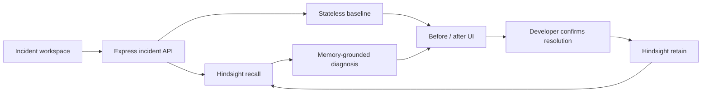

# Architecture and memory contract

## Memory contract

- One Hindsight bank per project (`bugfix-<project-id>`) prevents unrelated teams from contaminating recall.
- Recall uses Hindsight's semantic, keyword, graph, and temporal retrieval with a bounded token budget.
- Recalled content is labeled untrusted evidence in the model prompt to reduce prompt-injection risk.
- A diagnosis is never automatically retained. Only a developer-confirmed root cause, verified fix, and outcome enter durable memory.
- Retained incidents include context, timestamp, document ID, and tags so future versions can support filtering and updates.

## API

### `POST /api/incidents/analyze`

Accepts project, service, environment, severity, symptoms, optional logs, and a `memoryMode` of `compare` or `memory`.

### `POST /api/incidents/:incidentId/resolve`

Retains a confirmed resolution into the incident's project-scoped Hindsight bank.

### `GET /api/health`

Reports whether model and memory configuration are present without exposing secrets.
